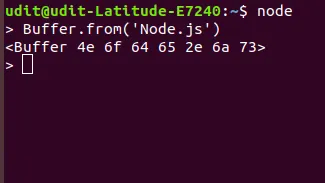
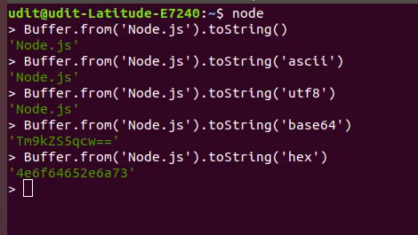
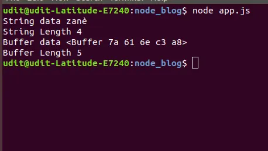

Введення до буферів у Node.js:

У Node.js буфер є властивістю об'єкта, доступним на глобальному рівні, і він широко використовується для роботи з потоками бінарних даних. Оскільки він доступний глобально, немає потреби підключати його через require у нашому коді.

Буфер фактично є блоком пам'яті, виділеною за межами купи V8. V8 є типовим двигуном JavaScript, який приводить у дію Node.js та Google Chrome. У Node.js буфери реалізовані за допомогою JavaScript typedArray (Uint8Array), але це не означає, що пам'ять, виділена для буферу, знаходиться всередині купи V8. Вона все ще явно виділяється поза купою V8.

Таким чином, можемо уявляти буфер як певний вид масиву, що представляє низькорівневу структуру даних для збереження послідовності бінарних даних, але є одна основна відмінність: на відміну від масивів, після того, як буфер був виділений, його розмір не можна змінити.

Вступ

Buffer - це властивість об'єкта Node's глобального об'єкта, яка широко використовується в Node для роботи з потоками бінарних даних. Оскільки вона доступна глобально, немає потреби підключати її в нашому коді.

Buffer фактично представляє собою частину пам'яті, що виділяється поза кучею V8. V8 - це типовий двигун JavaScript, який використовується в Node і Google Chrome. У Node буфери реалізовані за допомогою типізованого масиву JavaScript (Uint8Array), але це не означає, що пам'ять, виділена для буфера, знаходиться всередині кучі V8. Вона все ще явно виділяється поза кучею V8.

Таким чином, ми можемо розглядати буфер як певний тип масиву, який є структурою даних нижчого рівня для представлення послідовності бінарних даних, але є одна велика різниця: на відміну від масивів, буфер не може змінювати свій розмір після виділення.

Буфер і кодування символів
Коли дані зберігаються у буфері або видобуваються з нього, це просто бінарні дані.

Буфер без вказівки кодування
Оскільки ми створюємо буфер із рядка Node.js (ми обговоримо створення буферів за кілька секунд), можна побачити попередній перегляд послідовності шістнадцяткових чисел. Це тому, що ми не вказали жодного кодування символів.

Отже, коли ми маємо буфер, обов'язково повинно бути вказано кодування символів для правильного зчитування даних (тобто, якщо ми зчитуємо який-небудь вміст з файлу або з деякого сокету, ми отримаємо об'єкт буфера, якщо не вказуємо кодування символів, ми отримаємо об'єкт буфера).

Буфер з різним кодуванням символів
Можна побачити, що при застосуванні різних кодувань символів до буфера ми отримуємо різні результати. Таким чином, кодування символів може впливати на спосіб, яким ми бачимо наші дані. Якщо методу toString() не передається аргумент, він за замовчуванням використовує кодування 'utf8'.

Різні типи підтримуваних кодувань символів в Node.js:

'ascii' - тільки для 7-бітних ASCII-даних
'utf8' - багатобайтові кодовані символи Unicode. Багато веб-сторінок та інших форматів документів використовують UTF-8.
'utf16le' - 2 або 4 байти, символи Unicode зі зміщенням little-endian
'ucs2' - псевдонім для 'utf16le'
'base64' - кодування Base64
'latin1' - спосіб кодування буфера в рядок з однобайтовим кодуванням
'binary' - псевдонім для 'latin1'
'hex' - кодування кожного байта як двох шістнадцяткових символів

Створення буфера
Існує три найбільш популярних способи створення буферів:

Buffer.from()
Buffer.alloc()
Buffer.allocUnsafe()

Buffer.from()
Buffer.from використовується для створення буфера з масиву, рядка або самого буфера.

Buffer.from('Node.js') результат - <Buffer 4e 6f 64 65 2e 6a 73>

Buffer.alloc()
Buffer.alloc приймає розмір (ціле число) в якості аргумента і повертає новий ініціалізований буфер вказаного розміру (тобто створює заповнений буфер певного розміру).

Buffer.alloc(8) результат - <Buffer 00 00 00 00 00 00 00 00>

Тут ми маємо буфер на 8 байтів, і кожен біт заповнений нулем.

Buffer.allocUnsafe()
Buffer.allocUnsafe приймає розмір як аргумент і повертає новий буфер, який не ініціалізується. Це означає, що він може містити деякі старі або конфіденційні дані з вашої пам'яті. Тому його слід використовувати обережно. Оскільки при створенні буфера не проводиться ініціалізація, цей метод є швидшим, ніж Buffer.alloc().

Buffer.allocUnsafe(8) може повернути <Buffer d0 ce ed 02 00 00 00 00>

Ми можемо побачити, що в нашому буфері є деяка інформація, яка відображається безпосередньо з нашої пам'яті. Щоб захистити нашу конфіденційну інформацію, ми повинні заповнити цей буфер за допомогою методу fill().

Buffer.allocUnsafe(8).fill() результат - <Buffer 00 00 00 00 00 00 00 00>

Відмінності між рядками/масивами і буферами
Як у рядків, так і в буферів є властивість length, і вони працюють однаково.

    ``
Тепер, як бачимо, незважаючи на те, що властивість length поводиться однаково для рядка і для буфера, ми отримуємо різні відповіді. Це тому, що рядок рахує символи на основі кодування UTF-8, а буфер рахує фактичну кількість байтів, які використовуються для представлення заданого рядка.

Так само, як для масивів і рядків, для буферів ми можемо використовувати операції, такі як slice, indexOf та багато інших. Але є деякі відмінності, коли ми використовуємо ці методи на буфері.

Скажімо, що ми хочемо застосувати операцію slice до масиву arr.slice([початок[, кінець]]). Slice для масиву дає нам новий масив із зрізаними елементами від індексу початку до індексу кінця з оригінального масиву. Після slice обидва масиви матимуть різні посилання (тобто вони не ділять пам'ять, тому будь-які зміни в будь-якому з масивів не впливатимуть на інший).

Але це не стосується буфера. Коли ми застосовуємо операцію slice до буфера, наприклад, buf.slice([початок[, кінець]]), вона також повертає новий буфер, але новий буфер посилається на ту саму пам'ять, що і оригінал (просто зміщений та обрізаний за допомогою індексів початку і кінця). Тобто, будь-які зміни, які ми робимо в одному буфері, будуть відображені на інший.

Заключення

Буфери дуже корисні, коли нам потрібно читати такі речі, як зображення з потоку TCP, стислий файл або будь-які інші форми бінарних даних. Буфери широко використовуються в потоках в Node, тому корисно мати базове розуміння їх роботи.
