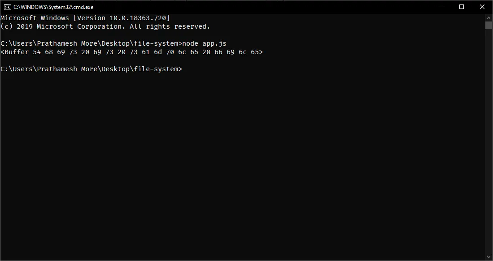
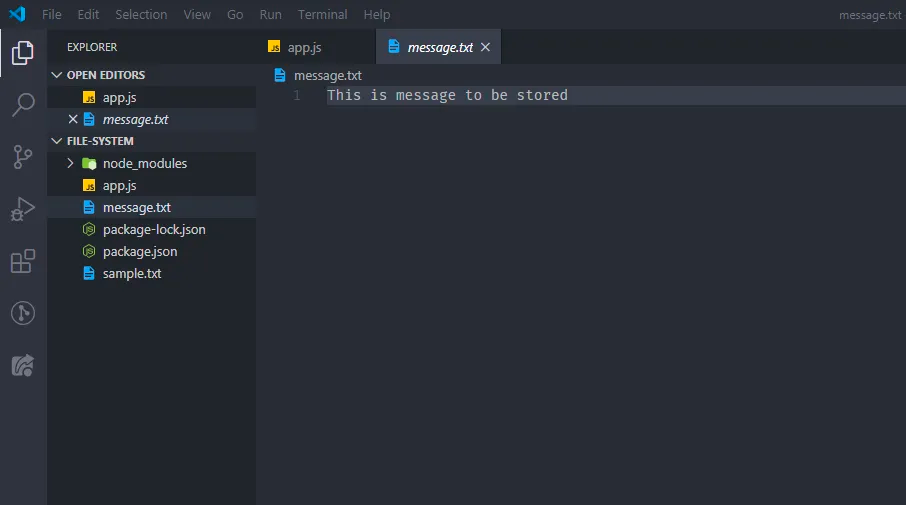
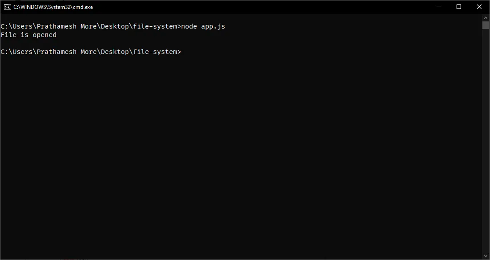
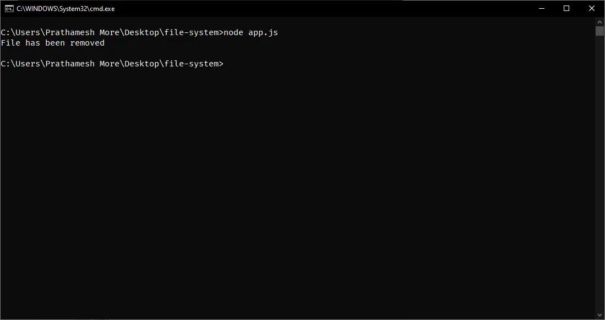
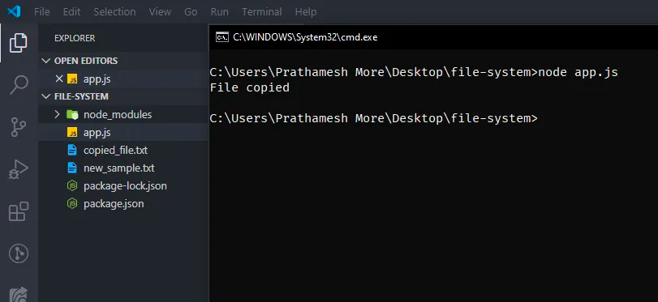

Модуль fsmodule надає нам API для взаємодії з файловою системою операційної системи (сервера).
Модуль fs надає API для взаємодії з файловою системою операційної системи. Всі операції з файлами можуть бути синхронними або асинхронними вводом/виводом. Асинхронні методи приймають перший параметр як помилку, а останній параметр - зворотний виклик (колбек).

У цьому посібнику ми ознайомимося з основними операціями вводу-виводу та деякими іншими концепціями модуля fs.

Основні операції вводу-виводу включають:
- Зчитування файлу
- Запис файлу
- Відкриття файлу
- Видалення файлу
- Перейменування файлу
- Копіювання файлу

Для початку роботи з файловою системою, нам потрібно імпортувати модуль fs у наш проект:

```javascript
const fs = require('fs');
```


Зверніть увагу, що це лише початок описування основних операцій, і в статті будуть розглянуті деталі та приклади кожної з них.

Читання файлу:
Асинхронно зчитує всі вміст файлу.

Метод: fs.readFile(path[, options], callback)

path — Шлях до файлу

options — Приймає додаткові параметри, наприклад, кодування. Цей параметр є необов'язковим.

callback — Функція зворотного виклику, яка приймає два параметри — err (помилка) та data (дані).
```javascript
const express = require('express');
const app = express();

const fs = require('fs');

fs.readFile('sample.txt', (err, data) => {
  if (err) {
    throw err;
  }
  console.log(data);
})
```
Вивід: Повертається необроблений буфер (Raw buffer).



Запис файлу:
Асинхронно записує вміст у файл і, за наявності, замінює файл.

Метод: fs.writeFile(file, data[, options], callback)

file — Розташування (шлях) файлу

data — Може бути рядком або буфером.

options — Приймає додаткові параметри, такі як кодування, режим і прапорці. Цей параметр є необов'язковим.

callback — Функція зворотного виклику, яка приймає два параметри — err (помилка) та data (дані).

```javascript
const express = require('express');
const app = express();

const fs = require('fs');

const data = Buffer.from('This is message to be stored');

fs.writeFile('message.txt', data, (err) => {
  if (err) {
    throw err;
  }
  console.log('The message.txt has been created');
});
```
Результат: файл створено



Відкриття файлу:
Асинхронне відкриття файлу.

Метод: fs.open(шлях[, прапори[, режим]], зворотній виклик)

шлях — Шлях до файлу

прапори — Прапори файлової системи

режим — Встановлює режим файлу, за замовчуванням файл доступний для читання та запису

зворотній виклик — Функція зворотного виклику, приймає два параметри — err (помилка) і fd (ідентифікатор файлу)

```javascript
const express = require('express');
const app = express();

const fs = require('fs');

fs.open('sample.txt', 'r+', (err, fd) => {
    if (err) {
        throw err;
    }
    console.log('Файл відкрито');
});
```

У цьому коді використовується Node.js модуль `fs` для асинхронного відкриття файлу з назвою `sample.txt` з режимом 'r+' (тобто читання та запис). Якщо відкриття файлу викликає помилку, вона буде виведена у вигляді виключення. В іншому випадку, якщо файл успішно відкрито, буде виведений повідомлення 'Файл відкрито'.

Вихід:



Видалення файлу:
Асинхронне видалення файлу або символічного посилання.

Метод: fs.unlink(шлях, зворотній виклик)

шлях — Шлях до файлу

зворотній виклик — Функція зворотного виклику, яка приймає параметр err (помилку)

```javascript
const express = require('express');
const app = express();

const fs = require('fs');

fs.unlink('message.txt', (err) => {
    if (err) {
        throw err;
    }
    console.log('Файл був видалений');
});
```

У цьому прикладі використовується Node.js модуль `fs` для асинхронного видалення файлу з назвою `message.txt`. Якщо видалення файлу спричинить помилку, вона буде виведена у вигляді виключення. В іншому випадку, якщо файл успішно видалено, буде виведено повідомлення 'Файл був видалений'.

Вихід:



Перейменування файлу:
Асинхронне перейменування файлу за шляхом `oldPath` на новий шлях `newPath`. У випадку, якщо `newPath` вже існує, файл буде перезаписаний.

Метод: fs.rename(oldPath, newPath, зворотний виклик)

oldPath — Шлях до файлу, який потрібно перейменувати

newPath — Нова назва файлу

зворотній виклик — Функція зворотного виклику, яка приймає параметр err (помилку)

```javascript
const express = require('express');
const app = express();

const fs = require('fs');

fs.rename('sample.txt', 'new_sample.txt', (err) => {
    if (err) {
        throw err;
    }
    console.log('Файл перейменовано');
});
```

У цьому прикладі використовується Node.js модуль `fs` для асинхронного перейменування файлу з назвою `sample.txt` на `new_sample.txt`. Якщо перейменування файлу спричинить помилку, вона буде виведена у вигляді виключення. В іншому випадку, якщо файл успішно перейменовано, буде виведено повідомлення 'Файл перейменовано'.

Вихід:


Копіювання файлів:
Асинхронне копіювання файлу з `src` до `dest`. За замовчуванням, якщо `dest` вже існує, він буде перезаписаний.

Метод: fsPromises.copyFile(src, dest[, flags])

src — Вихідне ім'я файлу для копіювання

dest — Ім'я файлу призначення для зберігання

flags — Модифікатори для операції копіювання. За замовчуванням: 0.

return — Повертає обіцянку (Promise)

fs.constants.COPYFILE_EXCL: Операція копіювання не вдасться, якщо dest вже існує.
fs.constants.COPYFILE_FICLONE: Операція копіювання спробує створити копію з дозволом copy-on-write. Якщо платформа не підтримує copy-on-write, буде використано альтернативний механізм копіювання.
fs.constants.COPYFILE_FICLONE_FORCE: Операція копіювання спробує створити копію з дозволом copy-on-write. Якщо платформа не підтримує copy-on-write, операція не вдасться.

```javascript
const express = require('express');
const app = express();

const fs = require('fs').promises;

fs.copyFile('new_sample.txt', 'copied_file.txt')
  .then(() => {
    console.log('Файл скопійовано');
  })
  .catch((err) => {
    console.log(err);
  });
```

У цьому прикладі використовується метод `copyFile` з обіцянкою (Promise) з модуля `fs.promises` для асинхронного копіювання вмісту файлу з назвою `new_sample.txt` до нового файлу з назвою `copied_file.txt`. Якщо копіювання файлу спричинить помилку, вона буде оброблена у блоках `catch`. В іншому випадку, якщо файл успішно скопійовано, буде виведено повідомлення 'Файл скопійовано'.

Вихід:


